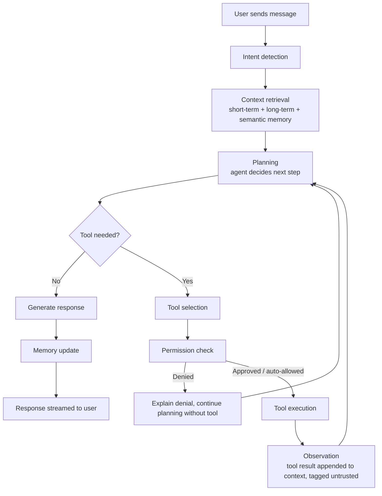
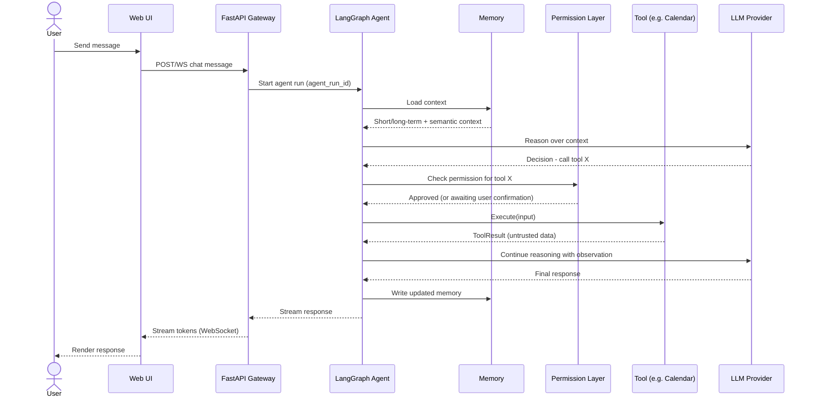
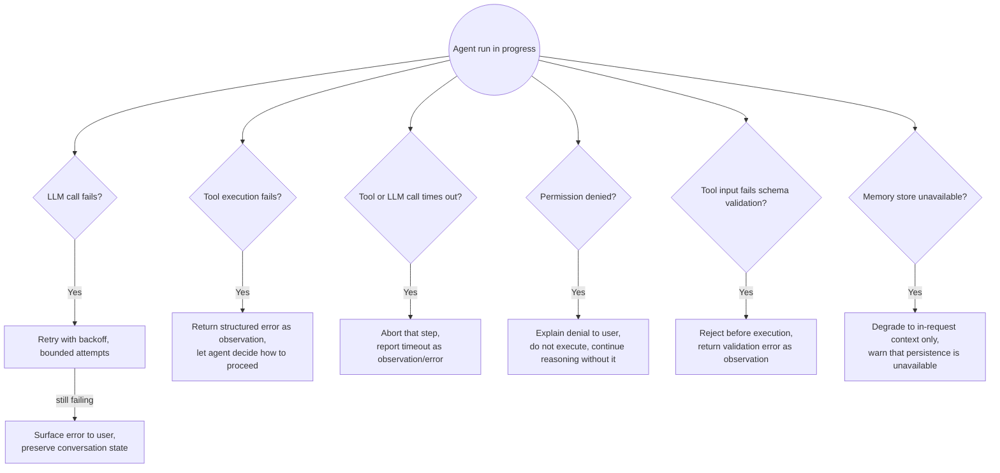

# Agent Flow

Status: Design document for Phase 2 (agent + tool calling). Not implemented in Phase 0.
Last updated: 2026-08-11

This document describes the intended lifecycle of a single user turn once the LangGraph agent (Phase 2) exists. Phase 1 (plain chat) does not use this flow — it is a direct LLM call with no tool loop.

## 1. Happy-path flow

The loop between `D` (Planning) and `K` (Observation) is what allows chained tool use, e.g. "look up tomorrow's events, then draft a summary email" — the agent replans after each observation rather than committing to a fixed sequence upfront.

## 2. Sequence view (single tool call)

## 3. Error flows

The agent core must degrade predictably. None of these should crash the agent run or leave the conversation in an inconsistent state.

| Failure | Handling |
|---|---|
| LLM provider failure (timeout, 5xx, rate limit) | Bounded retry with backoff; on exhaustion, surface a clear error to the user without losing their message. |
| Tool execution failure (exception, non-zero exit, API error) | Captured as a structured error result, fed back to the agent as an observation — the agent decides whether to retry, try another approach, or tell the user it failed. Never silently swallowed. |
| Timeout (tool or LLM) | The specific step is aborted and reported as a timeout observation/error; the rest of the conversation state is preserved. |
| Permission rejection | Not an error — an expected control-flow branch. The agent explains what it wanted to do and why it can't, and continues without that tool. |
| Invalid tool input | Rejected by schema validation before `execute()` is ever called (fail closed, per `BaseTool.input_schema` in `docs/architecture.md` §9). |
| Memory unavailable | Agent run degrades to using only in-request context (no persisted memory), and the user/logs are informed persistence is temporarily unavailable, rather than the run failing outright. |

## 4. Notes for implementation (Phase 2)

- `agent_run_id` is generated once per user turn and threaded through every node in the graph and every tool call, per the observability plan in `docs/architecture.md` §12.
- Tool results are never concatenated into the prompt as if they were trusted system/user instructions — see `docs/security.md` for the prompt-injection rationale.
- This document will be revised once the LangGraph graph is actually implemented; treat it as the target design, not a guarantee of the final node names.
