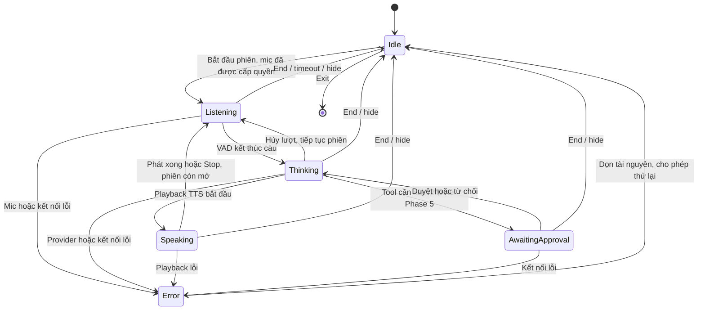

# Luồng voice, session và agent

Status: Proposed · 2026-09-07. Contract thiết kế, chưa có API thực thi.

## Kích hoạt và greeting

Click, shortcut hoặc tray đưa cửa sổ hiện có lên trước. Khởi chạy lần đầu hoặc bắt đầu phiên mới tạo greeting theo giờ local: 05:00–11:59 buổi sáng, 12:00–17:59 buổi chiều, 18:00–21:59 buổi tối, còn lại lời chào ban đêm. Không tự đọc lịch/email trước khi có integration và quyền tương ứng.

Phase 1 hiển thị greeting; Phase 2 thêm TTS có thể tắt. Focus lại cùng phiên không chào lặp. Lần đầu cần hành động bắt đầu nghe và cấp quyền microphone. Sau khi cấu hình quyền, shortcut gọi phiên có thể bắt đầu nghe với chỉ báo rõ ràng.

## Máy trạng thái voice từ Phase 2

Visibility, session và voice state là các khái niệm riêng. Hide kết thúc session và trở về Idle, tray vẫn tồn tại. Exit dừng app và child process do nó sở hữu. Greeting TTS là output riêng trước khi nghe, dùng cùng cơ chế playback/cancel. TTS tắt thì Thinking chuyển thẳng về Listening sau text; text-only giữ capture tắt và về Idle trong session text còn mở.

Phase 1 mô phỏng trạng thái voice trong development harness có nhãn. Từ Phase 2, Conversation Manager là nguồn trạng thái session/turn chuẩn; UI không đặt Speaking chỉ vì nhận text. Desktop báo playback thực sự bắt đầu/kết thúc về backend.

## Một lượt nói

1. Desktop tạo session đã xác thực, nhận giới hạn audio/thời hạn.
2. Mic thu trong RAM; VAD phát hiện câu với pre-roll nhỏ và giới hạn 30 giây. Im lặng không gọi STT.
3. Desktop resample và gửi đoạn nói gắn session/turn ID. Backend kiểm tra thứ tự, định dạng, kích thước, thời lượng.
4. STT trả transcript cuối. Partial transcript không kích hoạt agent/tool; transcript rỗng trở về nghe, không tạo prompt rỗng.
5. Phase 2 dùng phản hồi cố định; Phase 3 gọi LLM với context RAM; Phase 4 thêm agent/tool loop.
6. Text trả lời hiển thị và được chia theo câu/đoạn ổn định cho TTS. Không đọc tool arguments, stack trace hoặc secret ra loa.
7. Playback có thứ tự; dừng capture/VAD trong lúc phát để giảm tự nghe chính mình. Phát xong tiếp tục nghe trong cùng phiên.
8. End/hide/exit, disconnect hoặc timeout dọn queue/buffer/context. Lượt cũ không tự tiếp tục.

V1 nói luân phiên nhưng không cần gọi lại trợ lý giữa các câu. Voice barge-in cần kiểm chứng echo cancellation về sau; nút Stop luôn khả dụng.

## WebSocket contract dự kiến

Control envelope: `protocol_version`, `event_id`, `session_id`, `turn_id` khi có lượt, `sequence`, `type`, `payload`. Version đầu đề xuất `1`; JSON Schema sẽ khóa ở Phase 2. Greeting dùng `output_id` trong session thay user turn, vẫn kiểm tra thứ tự và hủy được.

| Hướng | Sự kiện | Ý nghĩa |
| --- | --- | --- |
| Desktop → backend | `session.start`, `session.end` | Sau handshake xác thực |
| Desktop → backend | `audio.start`, binary frames, `audio.end` | Encoding/sample rate/channels và đoạn nói |
| Desktop → backend | `text.submit` | Fallback từ Phase 3 |
| Desktop → backend | `turn.cancel`, `output.cancel` | Hủy lượt hoặc greeting/output riêng |
| Desktop → backend | `playback.started`, `playback.finished` | Trạng thái thiết bị thực tế |
| Backend → desktop | `session.ready`, `state.changed` | Cấu hình và trạng thái chuẩn |
| Backend → desktop | `transcript.partial`, `transcript.final` | Transcript tạm/cuối |
| Backend → desktop | `response.delta`, `response.final` | Text trả lời |
| Backend → desktop | `speech.start`, binary frames, `speech.end` | TTS kèm output ID và codec |
| Hai chiều | `approval.requested`, `approval.resolved` | Phase 5 |
| Backend → desktop | `error`, `turn.cancelled`, `output.cancelled` | Lỗi chuẩn hóa hoặc xác nhận hủy |

Binary envelope cần session ID, turn ID hoặc output ID, stream ID và sequence; layout byte khóa ở Phase 2 trong `packages/contracts`. Không suy đoán audio thuộc lượt mới vì lượt cũ vừa hủy. Turn mới khi đang busy bị từ chối hoặc phải cancel turn trước.

Đề xuất PCM input 16 kHz/mono/16-bit, tối đa 30 giây = 960.000 byte payload; mỗi frame tối đa 64 KiB gồm envelope. Giới hạn cả tổng payload và deadline upload; queue hữu hạn. Output TTS phải có giới hạn riêng theo codec khi chọn adapter.

## Hủy, lỗi và reconnect

- Cancel gắn ID: đánh dấu lượt mất hiệu lực, ngắt STT/LLM/TTS khi adapter hỗ trợ, dọn queue và bỏ output đến muộn. Provider không hủy được thì bỏ kết quả; không cam kết dừng chi phí ngay.
- Stop dừng playback cục bộ ngay; end session đóng mic ngay và gửi cancellation best-effort.
- Disconnect kết thúc phiên; reconnect xác thực lại, tạo session mới. Không replay audio/tool/approval cũ. Context RAM không phải persistent memory.
- Tác vụ đã ghi dữ liệu có thể không hoàn tác khi cancel. Executor ghi known/failed/unknown; kết quả unknown cần đối soát, không tự retry.
- Error có code, thông điệp dễ hiểu, retryability và correlation ID; không trả chi tiết nhạy cảm vào transcript.

## Agent loop từ Phase 4

Final transcript/text → context được phép → LLM đề xuất tool → validate schema + policy → approval nếu hỗ trợ và cần thiết → executor → kết quả có nguồn → trả lời hoặc bước tiếp theo.

Đề xuất tối đa 5 tool call/turn, timeout theo tool và deadline toàn lượt. Nội dung tool/memory là dữ liệu không đáng tin, không thể tự sửa policy/cấp quyền. Trước Phase 5, ghi luôn bị từ chối; registry chỉ công bố tool trong scope. Xem [security](security.md) và [ADR agent](adr/0002-agent-framework.md).
