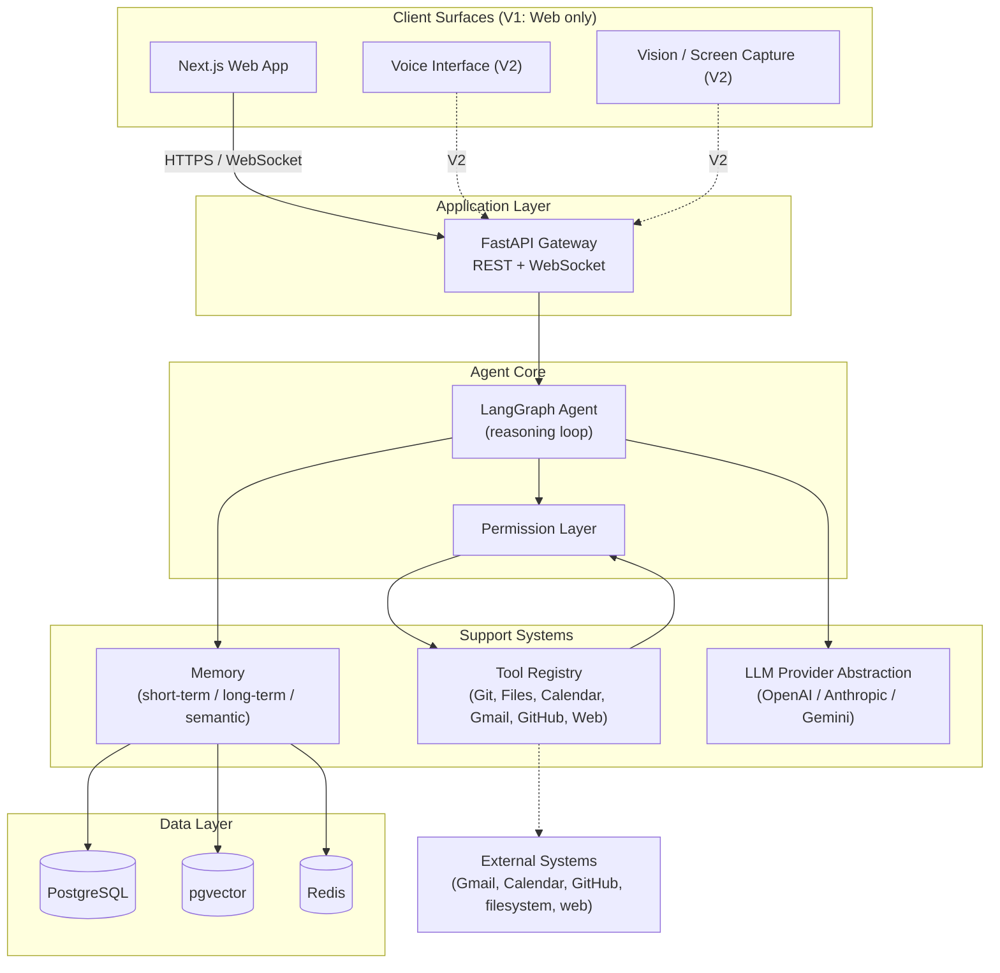
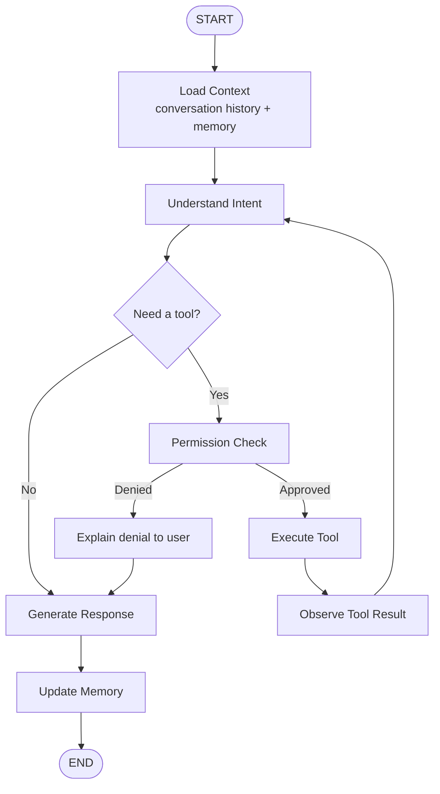
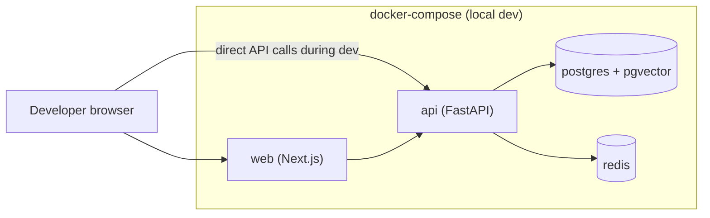

# Architecture

Status: Living document — updated as decisions are made or revised.
Last updated: 2026-08-11

## 1. System Overview

Personal AI Assistant is a modular, self-hosted AI agent platform for a single owner-operator (initially one user: the project owner). It is built to eventually behave like a practical personal JARVIS-style assistant: a conversational agent that can reason, call tools, remember context across sessions, and — with explicit permission — take actions on the user's behalf (reading/writing code, managing calendar and email, running local automations, and eventually operating with voice, vision, and desktop control).

The system is being built incrementally. This document describes the target architecture for **Version 1** (Phases 0–6: foundation, chat, agent + tools, permissions, memory, coding assistant, personal integrations) and sketches **Version 2** (Phases 7–11: automation, voice, desktop agent, vision, multi-agent) at a conceptual level so V1 decisions don't box the project in.

Nothing beyond Phase 0 (documentation and scaffolding) has been implemented as of this writing.

## 2. Architecture Goals

| Goal | Meaning here |
|---|---|
| Modularity | Backend is a modular monolith with clear internal boundaries (api / agent / tools / memory / integrations), not a tangle of scripts. |
| Extensibility | New tools, new LLM providers, and new integrations can be added without rewriting the agent core. |
| Security | Every tool call that can affect the outside world (filesystem, email, calendar, code, shell) passes through an explicit permission layer. Untrusted content is never treated as instructions. |
| Observability | Every agent run is traceable end-to-end: request → reasoning → tool calls → response. |
| Provider independence | The system is not hard-wired to one LLM vendor. An `LLMProvider` abstraction sits between the agent and OpenAI/Anthropic/Gemini SDKs. |
| Testability | Business logic (agent orchestration, tool contracts, permission checks) is unit-testable without a live LLM or live external services. |
| Maintainability | Prefer boring, well-understood technology (Postgres, Redis, FastAPI, Next.js) over trendy infrastructure the project doesn't yet need. |

## 3. High-Level Architecture



Key point vs. the original conceptual diagram in the project brief: tools do **not** call external systems directly on the agent's say-so. Every tool invocation is routed through the **Permission Layer** first (see §10), and the layer's decision (allow / deny / require confirmation) is itself logged.

## 4. Component Architecture

| Component | Scope |
|---|---|
| Web app (Next.js) | V1 |
| FastAPI gateway (REST + WebSocket) | V1 |
| LLM provider abstraction | V1 |
| LangGraph agent core | V1 |
| Tool registry + `BaseTool` contract | V1 |
| Permission layer | V1 |
| Short-term memory (Redis) | V1 |
| Long-term memory (Postgres) | V1 |
| Semantic memory (pgvector) | V1 |
| Coding tools (git status/diff/log, code search) | V1 |
| Google Calendar / Gmail / Drive, GitHub integrations | V1 |
| Automation engine (scheduler, recurring/conditional tasks) | V2 |
| Voice (STT/TTS) | V2 |
| Desktop agent (local bridge, app launcher) | V2 |
| Vision (screen capture, screen understanding) | V2 |
| Multi-agent supervisor (Coding / Research / Personal agents) | V2 |

## 5. Backend Architecture

The backend is a **modular monolith** (single deployable FastAPI service) organized in layers, not a set of microservices. Rationale: a single user, low request volume, and a fast-moving agent core make service-boundary overhead pure cost right now (see ADR-0001).

```text
apps/api/app/
├── api/            # HTTP + WebSocket route handlers (thin controllers)
├── core/           # config, settings, DI wiring, LLM provider abstraction
├── agents/         # LangGraph graph definitions, agent state, nodes
├── tools/          # BaseTool contract + concrete tool implementations
├── memory/         # short-term / long-term / semantic memory interfaces
├── models/         # SQLAlchemy ORM models
├── schemas/        # Pydantic request/response DTOs
├── services/       # application/use-case logic (orchestrates repositories + agent)
├── repositories/   # data-access layer over SQLAlchemy models
├── integrations/   # Gmail / Calendar / GitHub / web clients
└── observability/  # structured logging, tracing IDs, metrics
```

Dependency direction (outer depends on inner, never the reverse):

```text
api  →  services  →  agents / tools / memory  →  repositories  →  models
                              ↓
                        integrations (via tools)
core (config, LLM abstraction) is depended on by everyone; it depends on nothing above it.
```

`api/` only translates HTTP/WebSocket ↔ DTOs and calls `services/`. `services/` never imports from `api/`. `agents/` and `tools/` never talk to the database directly — they go through `repositories/` or `memory/`. This keeps the agent core testable without a running FastAPI app or a live database.

## 6. Frontend Architecture

```text
apps/web/src/
├── app/            # Next.js App Router routes/layouts
├── components/     # Shared, presentation-only UI components
├── features/       # Feature-scoped modules (chat, auth, settings, ...), each owning its own components/hooks/state
├── hooks/          # Cross-feature reusable hooks
├── services/       # API client layer (REST calls), one module per backend resource
├── stores/         # Client-side state (chat session state, UI state)
├── types/          # Shared TypeScript types, generated/synced with backend schemas where practical
└── utils/          # Pure helper functions
```

A `websocket` client lives under `services/` and is responsible for connecting to the FastAPI WebSocket endpoint, reconnect/backoff, and dispatching streamed tokens/events into the chat store. UI components never open sockets directly.

## 7. Agent Architecture

Planned LangGraph flow for the agent core (implemented starting Phase 2; Phase 1 uses a direct LLM call with no graph):



Notes:
- The loop back from `Observe` to `Understand` is what allows multi-step tool use (e.g., "check my calendar, then draft an email").
- `PermCheck` is a hard gate, not a suggestion — a denied tool call never reaches `Execute`.
- Full detail, including error paths, is in `docs/agent-flow.md`.

## 8. Memory Architecture

| Tier | Purpose | Backing store | Lifetime |
|---|---|---|---|
| Short-term memory | Current conversation's working context (recent turns, scratch state for a single agent run) | Redis | Minutes–hours; session-scoped, TTL-based |
| Long-term memory | Durable structured facts and conversation history the user has had with the assistant | PostgreSQL | Indefinite, user-owned, deletable |
| Semantic memory | Similarity-searchable knowledge (past conversations, documents) for retrieval-augmented context | PostgreSQL + pgvector | Indefinite, rebuildable from long-term memory |

Short-term memory is optimized for low-latency read/write during a single agent run. Long-term memory is the source of truth. Semantic memory is a derived index over long-term memory (and later, documents) — it can in principle be rebuilt from long-term memory, which keeps pgvector from becoming a second source of truth.

Memory write policy (who decides what gets remembered) and retrieval scoring are Phase 4 design work and are intentionally not finalized in Phase 0.

## 9. Tool Architecture

All tools implement a common contract so the agent core can treat them uniformly (registration, schema validation, permission tagging, execution). Conceptual shape, not an implementation:

```python
class BaseTool(ABC):
    name: str
    description: str          # shown to the LLM for tool selection
    input_schema: type[BaseModel]   # Pydantic model, validated before execution
    permission_level: PermissionLevel  # READ | SAFE_WRITE | CONFIRM | DANGEROUS

    async def execute(self, input: BaseModel, context: ToolContext) -> ToolResult:
        ...
```

- Tools declare their own `permission_level`; the permission layer (not the tool) enforces what happens at each level.
- `ToolContext` carries the request/conversation/agent-run IDs needed for observability and for scoping what the tool is allowed to touch (e.g., which repo, which calendar).
- `ToolResult` is a structured object (not a raw string) so the agent and the UI can both render it appropriately, and so tool output can be clearly tagged as **untrusted data**, not instructions (see `docs/security.md`).

This contract is documented now so Phase 2 doesn't invent an incompatible shape per tool; it is not implemented in Phase 0.

## 10. Permission Architecture

| Level | Meaning | Example tools | Default behavior |
|---|---|---|---|
| `READ` | Reads data, no side effects | list calendar events, read a file, `git status` | Auto-allowed |
| `SAFE_WRITE` | Writes that are low-risk and easily reversible | create a draft (not send), write to a scratch/workspace file | Auto-allowed, logged |
| `CONFIRM` | Writes or actions with real-world effect that a reasonable user would want to approve first | send an email, create a calendar event, commit code, run a shell command | Requires explicit user approval before execution |
| `DANGEROUS` | Destructive or hard-to-reverse actions | delete files, force-push, delete calendar events, modify billing/account settings | Requires explicit confirmation with the specific action shown verbatim; some actions may be disabled entirely in V1 |

The permission layer sits between the agent and every tool (§3). It is a required hop, not opt-in per tool. Approval workflow, audit logging, and UI for confirmations are Phase 3 scope; this table defines the levels so Phase 2's `BaseTool.permission_level` field has a stable contract to target.

## 11. Deployment Architecture

### Development (V1)



All four services run via `docker-compose.yml` for local development. `web` and `api` also support running outside Docker (native `npm run dev` / `uvicorn --reload`) for faster iteration; only `postgres` and `redis` are expected to always run in Docker.

### Production (future, high level only)

Not built in Phase 0. Expected shape for a single-owner personal assistant: one small VPS or home server running the same `docker-compose` stack (or a slightly hardened variant) behind a reverse proxy (e.g. Caddy/Nginx) with TLS, rather than a Kubernetes cluster — this is a personal tool for one user, not a multi-tenant SaaS. This will be revisited if usage patterns prove that assumption wrong.

## 12. Observability

Every agent-related request should be traceable through four correlated IDs:

```text
request_id     — one per HTTP/WebSocket request
conversation_id — one per conversation thread
agent_run_id    — one per agent reasoning loop (a single "turn")
tool_run_id     — one per individual tool execution within an agent run
```

Planned structured log fields: timestamp, level, `request_id`, `conversation_id`, `agent_run_id`, `tool_run_id`, event type (e.g. `tool.invoked`, `tool.completed`, `llm.call`, `permission.denied`), latency, and — for LLM calls — token usage and estimated cost. Errors are logged with enough context to reconstruct what the agent was trying to do, without logging full tool payloads that may contain sensitive content (see `docs/security.md` §Logging policy).

This is a design target for Phases 1–4 to implement against, not something built in Phase 0.
