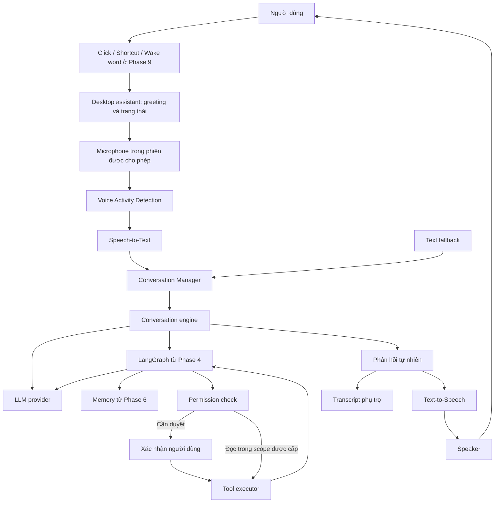
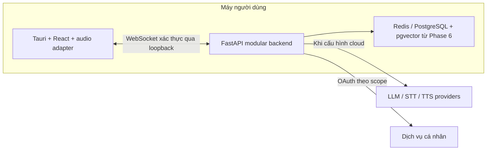

# Kiến trúc Voice-First Desktop Assistant

Status: Proposed · 2026-09-07 · Thiết kế Phase 0, chưa triển khai.

## Mục tiêu và ranh giới

Trợ lý desktop được gọi bằng click/shortcut, chào người dùng, hội thoại bằng giọng nói nhiều lượt và thực hiện tác vụ theo quyền. Windows x64 là nền tảng đầu tiên được đề xuất theo môi trường hiện tại; hỗ trợ macOS/Linux chưa được xác minh.

Version 1 dùng **modular monolith**: một backend Python chứa các mô-đun nghiệp vụ và một desktop client Tauri. Hai tiến trình là ranh giới UI/backend, không phải các microservice nghiệp vụ. Redis/PostgreSQL là dịch vụ dữ liệu tùy giai đoạn.

## Luồng tổng thể

Phase 2 dùng phản hồi cố định để kiểm tra speech. Phase 3 thay bằng LLM; Phase 4 mới thêm LangGraph. Greeting theo giờ là logic cục bộ, không cần LLM.

## Thành phần và trách nhiệm

| Vị trí dự kiến | Trách nhiệm | Bắt đầu |
| --- | --- | --- |
| `apps/desktop` | React/TypeScript hiển thị presence, transcript, điều khiển; Tauri quản lý cửa sổ, tray, shortcut và vòng đời native | 1 |
| `apps/backend` | FastAPI, WebSocket, cấu hình và vòng đời một backend | 2 |
| Backend / voice | STT/TTS adapter, hủy và giới hạn tài nguyên | 2 |
| Backend / conversation | Session, turn, trạng thái chuẩn, timeout và transcript | 2–3 |
| Backend / providers | LLM adapter: streaming, timeout, cancellation và lỗi chuẩn hóa | 3 |
| Backend / agent | LangGraph state, tool proposal và giới hạn bước | 4 |
| Backend / permissions + tools | Policy trước mọi execution, deny by default, scope và audit | 4; mở rộng ở 5 |
| Backend / memory | Context tạm thời, lưu dài hạn có chính sách, truy hồi semantic | 6 |
| Backend / integrations | OAuth và adapter dịch vụ theo scope | 7 |
| `packages/contracts` | Đặc tả wire protocol; schema/kiểu chung khi triển khai | 2 |

Các mô-đun bên trong backend là dự kiến, chưa phải package Python tồn tại. Nghiệp vụ không import UI; UI không gọi SDK LLM hoặc giữ provider key. Tool và memory trả dữ liệu qua interface, không tự điều khiển UI.

## Âm thanh và realtime

- Phase 2 thử capture/playback trong WebView2 bằng microphone thật. Nếu không đạt, thử native capture adapter qua cùng interface và ghi ADR trước khi chọn.
- Đề xuất VAD ở desktop để xác định đoạn nói; STT/TTS ở backend. Backend kiểm tra metadata và giới hạn dữ liệu độc lập với client.
- Đầu vào đề xuất: PCM signed 16-bit, mono, 16 kHz; desktop resample từ thiết bị thật. Codec/sample rate đầu ra do TTS adapter khai báo. Chọn VAD và nhà cung cấp speech sau kiểm tra tiếng Việt, độ trễ và chi phí ở Phase 2.
- WebSocket mang control event và binary audio; contract session/turn ở [agent flow](agent-flow.md). FastAPI hỗ trợ WebSocket, còn framing ứng dụng do dự án thiết kế. [Tài liệu FastAPI](https://fastapi.tiangolo.com/advanced/websockets/).
- Voice V1 nói theo lượt: tạm dừng capture khi TTS phát, tiếp tục nghe trong cùng phiên sau playback. Nút Stop hủy ngay; ngắt lời bằng giọng nói đồng thời cần kiểm chứng echo cancellation sau baseline.
- Idle/hidden không capture. Hide/end/exit kết thúc phiên và giải phóng microphone. Wake word Phase 9 có chế độ chờ riêng, bật rõ ràng.

## Tiến trình và triển khai

Phase 1 chỉ chạy desktop. Phase 2–3 phát triển backend như tiến trình cục bộ, không cần database hoặc Docker để hội thoại. App chỉ dọn các child process do nó sở hữu, không dừng dịch vụ người dùng khởi chạy độc lập.

Đề xuất đóng gói backend thành sidecar cho bản phát hành; cần spike đóng gói/shutdown ở Phase 3. Tauri hỗ trợ nhúng executable qua sidecar, chưa chứng minh backend dự án đóng gói thành công. [Tauri sidecar](https://v2.tauri.app/develop/sidecar/).

Docker/Compose phục vụ hạ tầng phát triển và tùy chọn backend; desktop và thiết bị âm thanh chạy trên host. Xem [infrastructure](../infrastructure/README.md).

## Quyền, dữ liệu và các quyết định còn mở

Localhost vẫn cần token phiên và kiểm tra WebSocket Origin. Native host/bootstrap cấp token ngắn hạn qua kênh riêng; không đưa vào URL/bundle/log. Khóa handshake ở Phase 2 trước khi nhận audio. Xem [security](security.md).

Mọi tool call qua policy trước executor. Phase 4 chỉ cho công cụ giả lập hoặc đọc trong scope đã cấp; ghi dữ liệu bị chặn đến khi approval Phase 5 đạt kiểm tra. Audio chỉ giữ trong RAM theo lượt; context/transcript mặc định trong RAM theo phiên đến Phase 6.

Các lựa chọn được ghi tại [ADRs](adr/README.md). Chưa khóa phiên bản dependency. npm/C++ Build Tools cần kiểm tra đầu Phase 1; audio và provider speech ở Phase 2; LLM/model, hạn mức và đóng gói backend ở Phase 3. Không chọn dịch vụ trả phí hoặc cam kết offline khi chưa có kiểm chứng.
